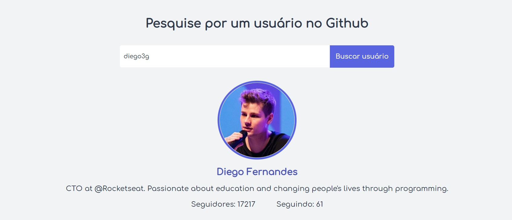

# Github Search

Pesquise Usuários no gihub

## Layout 🎨

### :rocket: Tecnologias utilizadas

O projeto foi desenvolvido utilizando as seguintes tecnologias:

- [SASS](https://sass-lang.com/)
- [Typecript](https://www.typescriptlang.org/)
- [React](https://pt-br.reactjs.org/)
- [HTML](https://developer.mozilla.org/pt-BR/docs/Web/HTML)
- [Webpack](https://webpack.js.org/)

### :memo: Licença

Este projeto está sob a licença MIT. Consulte [LICENÇA](License) para obter detalhes.
